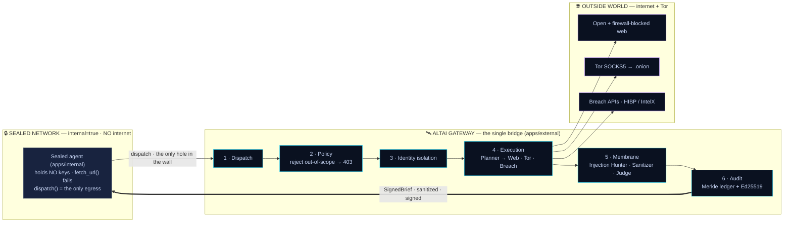
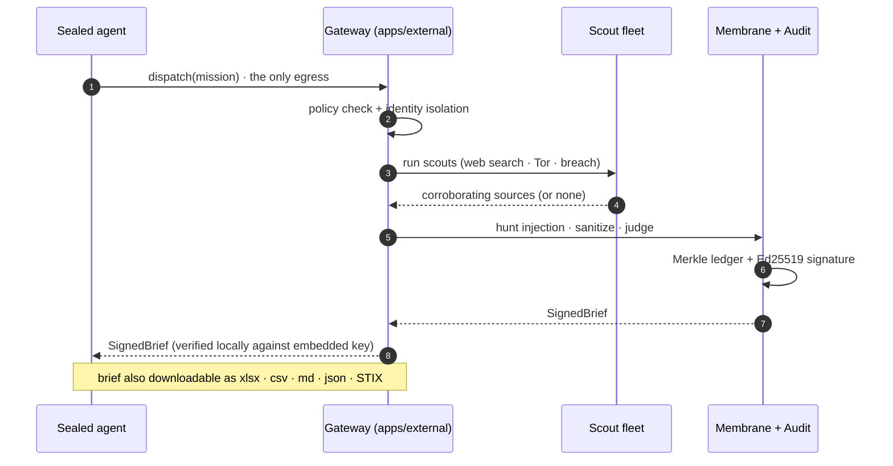
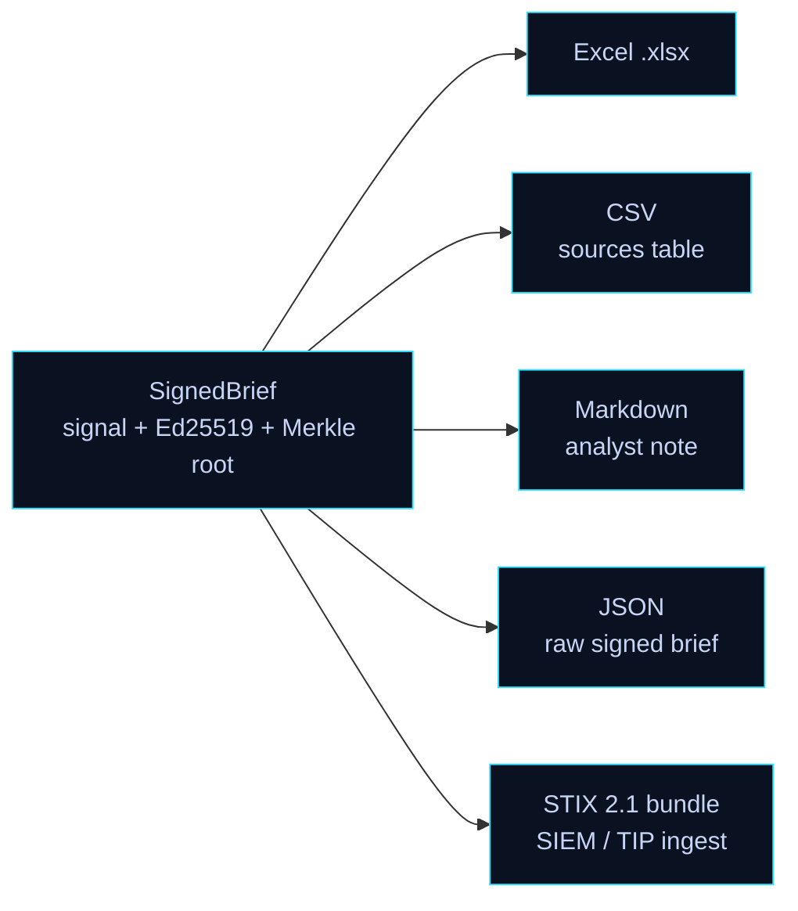
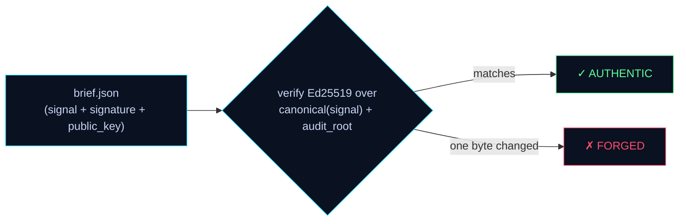

# Altai

**The sovereign external-action layer for air-gapped enterprise AI agents.**

Enterprises are deploying internal AI agents behind a hard rule from their CISO/DSI: **no outbound network access**. The agent runtime is air-gapped — no web, no third-party APIs, no Tor. This is the correct security posture, and it creates a real problem: the firm wants external intelligence, but forbids its own agents from reaching out to get it.

Altai closes that gap. A sealed internal agent **dispatches a mission** through a single audited egress. An isolated fleet of specialized external agents acts on the outside world — the open web, firewall-blocked sites, breach APIs, and Tor — a multi-agent **security membrane** verifies and cryptographically signs everything that crosses back, and the firm receives a **sanitized, sourced, signed intelligence brief**. The firm's identity and queries never touch the wire.

> Like a watchtower on high ground: your agents see across the whole valley while never leaving their own peak.

### Two things make Altai a moat, not a proxy

| | Pillar | What it means |
|---|---|---|
| 🛡️ | **Governed, identity-isolated egress** | A network-level air-gap (two Docker nets), policy at ingress, identity stripping, an adversarial inbound **membrane**, and an **Ed25519-signed, Merkle-attested** brief. Tampering is mathematically detectable — and any recipient can **verify a brief offline**, no trust required. |
| 📦 | **Agent-native deliverables** | The agent doesn't just return text — it **generates files**: Excel, CSV, Markdown, JSON, and **STIX 2.1** bundles, each stamped with the brief's cryptographic provenance. |

**See it:** `docker compose up --build` → open the sealed app, dispatch a real research mission, watch the ops-center light up live (policy → scouts → live Tor exit → membrane → signed brief), then download the signed brief as a `.xlsx` / STIX bundle and verify it offline.

---

## Table of contents

- [Why Altai](#why-altai)
- [Architecture](#architecture)
- [How it works (the six layers)](#how-it-works-the-six-layers)
- [Honest results, by construction](#honest-results-by-construction)
- [Agent deliverables (file generation)](#agent-deliverables-file-generation)
- [Project structure](#project-structure)
- [Getting started](#getting-started)
- [Configuration](#configuration)
- [Running the system](#running-the-system)
- [Demo script](#demo-script)
- [API reference](#api-reference)
- [Data contracts](#data-contracts)
- [Security model](#security-model)
- [Testing](#testing)
- [Tech stack](#tech-stack)
- [Roadmap](#roadmap)

---

## Why Altai

| Problem | Today | With Altai |
|---|---|---|
| Internal agents are air-gapped by policy | They simply can't answer questions about the outside world | They dispatch a mission to a governed egress and get a structured answer back |
| External intelligence is needed (breaches, leaks, alt-data) | Static vendor feeds for humans, or a slow analyst | An agent-native, on-demand fleet returns a sourced signal |
| Reaching closed/dark sources is risky and non-compliant | Breaks the security posture, or doesn't happen | Identity-isolated egress, defensive/read-only, every action audited |
| "How do we trust what comes back?" | No provenance, no guarantees | Ed25519-signed brief over a tamper-evident Merkle audit ledger |

Altai is **not a proxy or a VPN**. The value is the governance and verification around the egress: a policy engine, identity isolation, an adversarial inbound membrane, and cryptographic attestation. The proxy is the boring part; the moat is everything around it.

### Example use case

A desk wants to know whether a public company has been compromised. The internal (sealed) agent dispatches the question. Altai's fleet searches the open web, cross-checks breach APIs, and (over Tor) live-fetches dark-web sources, fuses the corroborating sources into a confidence score, and returns a signed brief. If nothing credible is found, it says so — `inconclusive` at confidence 0, never a fabricated answer. Every step is in the signed audit log.

---

## Architecture

Two Docker networks enforce the air-gap at the network layer. The sealed side has **no route to the internet**; its only reachable host is the Altai gateway. The gateway is the single bridge between the sealed network and the outside world.



Two consequences fall out of the topology, and both are demonstrable:

- The sealed container genuinely cannot reach the internet (`curl https://google.com` times out). Its only reachable host is the gateway.
- API keys (breach providers) live **only** on the gateway. The sealed environment holds no credentials and has no wire access.

### 🔌 MCP layer — how any agent dispatches a mission

The dispatch layer is exposed over **MCP** so *any* MCP-capable agent — not just our UI — can launch missions. The design is intentionally thin:

- **`apps/research-mcp` is a thin MCP adapter over `apps/external`.** It owns no research logic, fleet, mock data, audit or crypto. It speaks MCP (Streamable HTTP) and forwards each tool call to the external gateway via `EXTERNAL_URL`. Tools: `dispatch_research_mission` → `POST /api/missions`, `get_mission_status` → `GET /api/missions/:id/signal`, `fetch_signal` → `GET /api/missions/:id/signal` + `/audit`, and `export_brief_document` → `GET /api/missions/:id/export?format=` (so an MCP agent gets the Excel/CSV/Markdown/JSON/STIX file directly — `.xlsx` as an embedded base64 resource).
- **`apps/external` is the real research pipeline** — the single source of truth. The MCP path and the sealed app run the *exact same* governed flow (policy → identity isolation → web/Tor/breach fleet → membrane → Ed25519/Merkle audit). No duplicated fleet.
- **Policy blocking is enforced at ingress** (`apps/external/lib/policy.ts`, in `POST /api/missions`). Because it sits at the single mission entry point, *every* caller — the sealed agent, the MCP adapter, any future agent — is governed identically. Out-of-scope/unsafe missions are rejected with `403` before any execution.
- **The sealed app dispatches through MCP**: the internal agent drives the three MCP tools end-to-end (dispatch → status → fetch_signal) and gets back the sanitized, signed brief.

```
 internal-app ──MCP──► research-mcp ──HTTP(EXTERNAL_URL)──► external-app (policy@ingress → fleet → membrane → audit)
        (any MCP agent) ──MCP──► research-mcp ──► same pipeline
```

Run just this slice: `docker compose up --build research-mcp external-app internal-app` → sealed app at `http://localhost:3000/bank`, adapter health at `http://localhost:3200/health`.

---

## How it works (the six layers)

Every mission crosses six layers; every action is recorded into the audit ledger.

1. **Dispatch** — the sealed agent's only egress. The mission is parsed and validated against the shared `Mission` contract.
2. **Policy** — per-tenant governance: source allow/deny-list, scope (`osint_readonly`), data classes, spend caps. Out-of-policy missions are rejected before any execution.
3. **Identity isolation** — the client's identity, IP, and raw query never leave the gateway. The fleet acts under Altai's own egress.
4. **Execution** — a `Planner` decomposes the mission and runs specialized scouts in parallel:
   - **Web Scout** — a real keyless web search (DuckDuckGo), then fetches the actual top results. A page counts as corroboration *only* if it references the target entity **and** describes a breach/leak.
   - **Tor Scout** — Ahmia discovery + a live `.onion` fetch over SOCKS5, reporting the real Tor exit IP and country. The fetched content only counts if it actually references the target.
   - **Breach Scout** — HIBP / IntelX breach corroboration (returns `[]` gracefully when no key is configured).
5. **Membrane** — an adversarial inbound panel. Nothing crosses back until it passes:
   - **Injection Hunter** — scans the **actual fetched** dark-web/web content for prompt-injection and identity-exfil attempts; quarantines on hit. (A clean run honestly reports no injection — nothing is planted.)
   - **Sanitizer** — scrubs every field of the brief (PII, secrets, control chars, HTML/script, prompt-injection, unsafe URL schemes) *before* it is signed, so everything downstream — including generated documents — is clean by construction.
   - **Judge** — requires a clean pass, then signs the brief.
6. **Audit & attestation** — every action is hash-chained into a Merkle ledger; the Judge signs `canonical(signal) + merkleRoot` with Ed25519. The sealed side independently verifies the signature against the embedded public key. Tampering with any audit entry breaks the recomputed root while the signature stays valid — i.e. tampering is mathematically detectable.

**Confidence fusion.** Corroborating sources are fused into a single confidence via **noisy-OR** over independent sources.

### Mission lifecycle



---

## Honest results, by construction

Altai never fabricates a finding. The brief is built **only** from what the scouts actually corroborated:

- A web page or `.onion` counts as a source **only** if its fetched content references the target entity (and, for the web, describes a breach). Off-topic hits are fetched, logged, and discarded — not counted.
- The Injection Hunter scans the **real bytes** the scouts retrieved. There is no planted payload that "always fires".
- With zero corroboration the signal is `inconclusive` at confidence `0` with the summary *"No corroborating evidence found …"* — never a templated event or an inflated score.
- There is **one** runtime path. There is no scripted/demo fleet and no hardcoded "hero" case; if the real swarm errors it seals an honest inconclusive brief rather than falling back to a canned answer.

```bash
# A real company with public breach coverage → real corroboration:
curl -s -X POST localhost:3000/api/missions -H 'content-type: application/json' \
  -d '{"query":"Has Live Nation suffered a data breach?","target_entity":"Live Nation","allowed_sources":["open_web","Ahmia"],"data_classes":["breach"],"max_spend_usd":5}'
# A nonsense target → inconclusive @ 0 (no fabrication).
```

---

## Agent deliverables (file generation)

A research agent that can only return prose is half a tool. Altai's agent turns a signed brief into the **file** the consumer actually needs — and every file carries the brief's Ed25519 provenance, so a spreadsheet or a SIEM feed is as verifiable as the JSON.



| Format | What it is | Who consumes it |
|---|---|---|
| **`.xlsx`** | Real multi-sheet workbook (Summary · Sources · Provenance) via ExcelJS | Analysts, PMs |
| **`.csv`** | RFC-4180 corroborating-sources table | Pipelines, spreadsheets |
| **`.md`** | Human-readable, provenance-stamped brief | Slack / email / tickets |
| **`.json`** | The full `SignedBrief` (signature + public key + audit root) | Machines, re-verification |
| **`.stix.json`** | **STIX 2.1** bundle (Identity + Indicators + Report + Relationships) with Altai attestation as `x_altai_*` custom properties | SIEM / TIP — OpenCTI, MISP, Sentinel, Splunk, QRadar |

These are the same formats real threat-intel platforms export, so an Altai brief drops straight into an existing security stack. The catalogue lives in `@altai/artifacts`; the gateway serves files at `GET /api/missions/:id/export?format=…` and the ops-center SIGNAL panel exposes one-click **Deliverables** buttons. The same surface works for any caller — the sealed agent, the [MCP adapter](#-mcp-layer--how-any-agent-dispatches-a-mission) (`export_brief_document` tool, with `.xlsx` returned as an embedded base64 resource), or a future agent.

#### Safe by construction — a generated file can't carry an attack

Turning untrusted intelligence into files opens real attack surfaces, so safety is enforced in **two layers**:

1. **The membrane (trust boundary).** Because the brief is sanitized *before* it is signed, every document inherits the guarantee. `sanitize()` scrubs **every** human-controlled field — PII, secrets, C0/C1 + zero-width control chars, HTML/script tags, prompt-injection payloads, and unsafe URL schemes (`javascript:`/`data:`/`file:` → `[BLOCKED_URL]`).
2. **Per-format encoding (defense in depth).** Each renderer hardens its own grammar: **CSV/XLSX** defuse spreadsheet **formula injection** (CWE-1236 — a leading `= + - @` is prefixed with `'`); **Markdown** escapes table/HTML breakouts; **STIX** escapes the URL inside the pattern string. JSON is data-only; filenames are slugged (no header/path injection).

```bash
# the agent writes you a real Excel workbook from the signed brief:
curl -s "localhost:3000/api/missions/$MID/export?format=xlsx" -o brief.xlsx
# or a STIX 2.1 bundle for your SIEM:
curl -s "localhost:3000/api/missions/$MID/export?format=stix" | jq '.objects[].type'
```

### Verifiable by anyone — "don't trust, verify"

The provenance isn't a badge you have to take on faith. Export `brief.json`, hand it to anyone, and they can **independently confirm** it's authentic and untampered — the Ed25519 public key travels *in* the file, so verification needs no shared secret and no call back to Altai.



The ops-center has a **VERIFY A BRIEF** drop-zone (drag the file in → ✓ / ✗); the same check is one stateless call — edit any value and it flips to forged:

```bash
curl -s -X POST localhost:3000/api/verify -H 'content-type: application/json' \
  --data-binary @brief.json | jq '{signature_valid, public_key_fingerprint}'
```

---

## Project structure

A pnpm + Turborepo monorepo. TypeScript end to end, with a single shared contract package every other package codes against.

```
altai/
├── apps/
│   ├── external/            Gateway + agent fleet + membrane + ops-center UI (port 3000)
│   │   ├── app/api/         missions · events (SSE) · signal · audit · tamper · export · verify · health
│   │   ├── app/page.tsx     Ops-center: live trace, signal card, deliverables, audit ledger, verify
│   │   └── lib/             gateway orchestration, mission store, fleet, policy, membrane+seal
│   ├── internal/            Sealed enterprise app (served under /bank)
│   │   ├── app/page.tsx     Sealed research form → dispatch via MCP → signed brief + audit
│   │   └── app/api/         research (drives the MCP tools; its only egress)
│   └── research-mcp/        Thin MCP adapter — exposes dispatch/status/fetch/export as MCP tools → forwards to the gateway
├── packages/
│   ├── contracts/           Zod schemas: Mission · Signal · SourceContribution · AuditEntry · SignedBrief · TraceEvent
│   ├── agents/              Planner + Scouts (web search · Tor · breach) + membrane (Injection Hunter, Sanitizer)
│   ├── crypto/              Ed25519 sign/verify + Merkle ledger + tamper helper
│   ├── artifacts/           File deliverables: xlsx (ExcelJS) · csv · markdown · json · STIX 2.1 — provenance-stamped
│   ├── tools/               web search + fetch · Tor SOCKS5 fetch · Ahmia · HIBP/IntelX
│   └── fixtures/            noisy-OR confidence fusion
├── docker-compose.yml       two networks (internal=true, external) — the cage
├── turbo.json               build/dev/test/typecheck pipeline
└── docs/superpowers/        architecture spec + phase plans
```

---

## Getting started

### Prerequisites

- **Node.js 22+**
- **pnpm 10+** (`corepack enable`)
- **Docker + Docker Compose** (for the full air-gapped topology)
- A Tor daemon is shipped as a Compose service; for local (non-Docker) runs, a SOCKS5 proxy on `127.0.0.1:9050` enables the Tor Scout (optional — it degrades gracefully).

### Install

```bash
git clone https://github.com/Symbioose/yc-hackathon.git
cd yc-hackathon
pnpm install
```

---

## Configuration

The system runs **with zero keys** — the Web Scout uses a keyless search, the Tor Scout degrades gracefully if no proxy is present, and the Breach Scout returns `[]` without a key. Configure only what you want to enable.

| Variable | Required | Description |
|---|---|---|
| `HIBP_API_KEY` | optional | Live Have I Been Pwned breach lookups (otherwise the Breach Scout returns none). |
| `INTELX_API_KEY` | optional | Live IntelX search. |
| `TOR_SOCKS_HOST` / `TOR_SOCKS_PORT` | optional | Tor SOCKS5 proxy (defaults `tor` / `9050` under Docker, `127.0.0.1` / `9050` locally). |
| `EXTERNAL_URL` | optional | Gateway URL the MCP adapter / sealed app dispatch to (default `http://localhost:3000`). |
| `RESEARCH_MCP_URL` | optional | MCP adapter URL the sealed app drives (default `http://localhost:3200/mcp`). |

---

## Running the system

### Full topology (Docker — recommended)

This is the only mode that reproduces the real air-gap.

```bash
docker compose up --build
```

- Ops-center: <http://localhost:3000>
- Sealed enterprise app: <http://localhost:3000/bank>

Verify the cage is real:

```bash
docker compose exec internal-app curl https://google.com                  # times out — no internet
docker compose exec internal-app curl http://external-app:3000/api/health # 200 — only the gateway is reachable
```

### Local development (no Docker)

```bash
pnpm --filter @altai/external dev   # gateway + ops-center on :3000
pnpm --filter @altai/internal dev   # sealed app (also reachable via :3000/bank)
pnpm --filter @altai/research-mcp dev   # MCP adapter on :3200
```

Note: local dev does not enforce the network air-gap (that's a Docker-only guarantee); it's for fast iteration on the gateway, fleet, and UI.

### Workspace commands

```bash
pnpm build        # build all apps and packages (turbo)
pnpm test         # run the full test suite
pnpm typecheck    # typecheck the whole workspace
```

---

## Demo script

The whole story, end to end, with zero keys required.

1. **The cage is real.** `docker compose exec internal-app curl https://google.com` times out; the same container reaches `external-app:3000/api/health`. The sealed side holds no keys and has no wire.
2. **A governed, real mission.** Open the sealed app at `/bank`, dispatch *"Has Live Nation suffered a data breach?"* The ops-center lights up: policy ✓ → identity stripped → scouts deploy → a **live Tor exit IP** is reported → the Web Scout finds real press corroboration → the **Judge signs** the brief → the **Merkle audit ledger** seals. Click **⚠ TAMPER** and watch the recomputed root turn red while the signature stays valid.
3. **An honest negative.** Dispatch a nonsense target → the brief comes back **`inconclusive` at confidence 0** — Altai reports reality, it doesn't invent a finding.
4. **Agent deliverables.** From the SIGNAL card, download the brief as **Excel**, **CSV**, **Markdown**, **JSON**, or a **STIX 2.1** bundle — each carrying the Ed25519 provenance.
5. **Don't trust — verify.** Drop that `brief.json` onto the **VERIFY A BRIEF** zone → ✓ AUTHENTIC. Open it, change one number, drop it again → ✗ FORGED. The proof is in the file.
6. **Any agent can do this.** The sealed app drives the same pipeline through the [MCP adapter](#-mcp-layer--how-any-agent-dispatches-a-mission) — dispatch → status → fetch_signal — and gets back the identical signed brief.

---

## API reference

The gateway (`apps/external`) exposes the egress and observability surface.

| Method | Endpoint | Description |
|---|---|---|
| `POST` | `/api/missions` | Dispatch a mission. Body: a `Mission`. Returns `{ id }` (or `403` if blocked by policy). |
| `GET` | `/api/events` | Server-Sent Events firehose of `TraceEvent`s and the final `signal`. |
| `GET` | `/api/missions/:id/signal` | The `SignedBrief` once ready (`202` while in progress). |
| `GET` | `/api/missions/:id/audit` | Audit ledger + `signature_valid` + `ledger_ok`. |
| `POST` | `/api/missions/:id/tamper` | Demo control: mutate one ledger entry to show tamper-evidence. |
| `GET` | `/api/missions/:id/export?format=` | Download the brief as a file: `xlsx · csv · md · json · stix`. |
| `POST` | `/api/verify` | Stateless verification — body: a `SignedBrief`. Returns `signature_valid` + signer fingerprint. |
| `GET` | `/api/health` | Liveness probe. |

The sealed app (`apps/internal`, under `/bank`) exposes only its egress:

| Method | Endpoint | Description |
|---|---|---|
| `POST` | `/bank/api/research` | The sealed agent's single outbound action → drives the MCP tools (dispatch → status → fetch_signal) and returns the signed brief + audit. |

---

## Data contracts

All packages code against `@altai/contracts` (Zod schemas → inferred TypeScript types). The core objects:

```ts
Mission           // what the sealed agent dispatches
{ id, query, target_entity?, ticker?, allowed_sources[], scope: "osint_readonly",
  data_classes[], max_spend_usd }

SourceContribution // one independent corroborating source (feeds confidence fusion)
{ name, type: "tor_forum"|"breach_api"|"paste"|"press"|"filing", url?, reliability, observed_at }

Signal            // the structured intelligence output
{ entity, ticker?, event_type, sources[], confidence, confidence_method: "noisy_or",
  observed_at, disclosed_at?, summary }

AuditEntry        // hash-chained Merkle leaf
{ seq, ts, actor, action, source?, target?, hash, prev_hash }

SignedBrief       // what crosses back to the sealed agent
{ signal, audit_root, signature, public_key }

TraceEvent        // streamed over SSE; drives the ops-center
{ mission_id, ts, layer, agent, level, msg, meta? }
// layer ∈ dispatch · policy · identity · execution · membrane · audit
```

Deliverables are generated by `@altai/artifacts` from a `SignedBrief` into an `Artifact`
(`{ format, filename, mime, body }`) — the `body` is text for `csv/md/json/stix` and bytes
for `xlsx`. Every artifact embeds the brief's Ed25519 signature + Merkle root.

---

## Security model

- **Network air-gap.** The sealed network is `internal=true` — no NAT, no route to the internet. The only reachable host is the gateway. Enforced by Docker, not by application code.
- **No credentials on the sealed side.** API keys live only on the gateway. The sealed environment can't leak what it doesn't hold.
- **Identity isolation.** The client's identity, IP, and raw query never leave the gateway; the fleet acts under Altai's egress.
- **Defensive / read-only.** Scope is fixed to OSINT read-only. The fleet observes and reports; it never transacts.
- **Inbound membrane.** Every human-controlled field of the brief is sanitized *before signing* — PII, secrets, control chars, HTML/script, prompt-injection, and unsafe URL schemes — and the dark-web/web snippets the scouts actually fetched are scanned for prompt-injection (quarantine on hit). Because it happens pre-signature, the sealed agent, the UI, and every generated document inherit a clean signal.
- **Safe document generation.** On top of the membrane, each export format hardens its own grammar (CSV/XLSX formula-injection neutralization, Markdown table/HTML escaping, STIX pattern escaping), so an exported `.xlsx`/`.md`/STIX file can't execute attacker-controlled content (CWE-1236 / XSS / injection).
- **No fabrication.** The signal is built only from corroborated sources; zero corroboration yields an honest `inconclusive`. There is no scripted/demo fleet and no hardcoded result.
- **Tamper-evident provenance.** Every action is hash-chained into a Merkle ledger; the brief is Ed25519-signed over the signal plus the Merkle root. Altering any entry breaks the recomputed root, and the sealed side detects it on verification.
- **Independently verifiable.** The signing public key travels inside the `SignedBrief`, so any recipient can confirm authenticity offline — no shared secret, no trusted call-back to Altai. `POST /api/verify` (and the ops-center drop-zone) re-checks the signature; one altered byte flips it to forged.

---

## Testing

```bash
pnpm test        # all packages
pnpm typecheck   # all packages
```

Coverage spans the contract schemas, the crypto (Ed25519 round-trip, Merkle root, tamper detection, independent forged-brief rejection, key fingerprint), the tools (web/breach graceful degradation, Tor), the agents (planner synthesis incl. honest `inconclusive`, the scout relevance/breach gates, membrane injection detection, and full-field sanitization — HTML/control-char/injection/secret/unsafe-URL scrubbing with no false positives on clean briefs), the fixtures (noisy-OR confidence fusion), and the artifacts (CSV escaping, deterministic STIX 2.1 bundle, a real round-tripped `.xlsx`, and document-security: CSV/XLSX formula-injection + Markdown/STIX injection neutralization).

---

## Tech stack

- **Language:** TypeScript across the whole monorepo.
- **Apps:** Next.js 15 (App Router), React 19; PixiJS + GSAP for the ops-center visualization.
- **Contracts:** Zod.
- **Crypto:** Node `crypto` (Ed25519) + a hand-rolled Merkle ledger.
- **Deliverables:** `exceljs` for real `.xlsx`; hand-rolled CSV / Markdown / JSON / **STIX 2.1** (OASIS CTI).
- **Egress:** `fetch-socks` over a Tor SOCKS5 daemon; native `fetch` for clear-web search/fetch and breach APIs.
- **MCP:** `@modelcontextprotocol/sdk` (Streamable HTTP) in `apps/research-mcp`.
- **Tooling:** pnpm workspaces + Turborepo.
- **Runtime:** Docker Compose, two networks (the cage).

---

## Roadmap

- **✓ Agent deliverables (shipped).** The brief is downloadable as Excel / CSV / Markdown / JSON / STIX 2.1, each provenance-stamped. See [Agent deliverables](#agent-deliverables-file-generation). Next: PDF and MISP, plus push-delivery to S3 / a SIEM.
- **✓ MCP server (shipped).** `apps/research-mcp` exposes dispatch / status / fetch_signal / export as Model Context Protocol tools so any MCP-capable agent (Claude Desktop, Cursor, …) can call Altai natively.
- **On-prem / local inference** — run an analyst LLM on local open-weight models behind the gateway so the client's queries never leave the perimeter (SGX / confidential compute for attestation).
- **Expanded sources** — Telegram channels, paste sites, additional breach providers, and pluggable OSINT connectors.
- **Marketplace** — open the fleet to third-party specialized agent providers that bid on dispatched missions.
- **Policy & multi-tenancy** — a real policy editor, per-tenant isolation, spend metering, and exportable compliance reports.

---

## License

Proprietary — all rights reserved.
