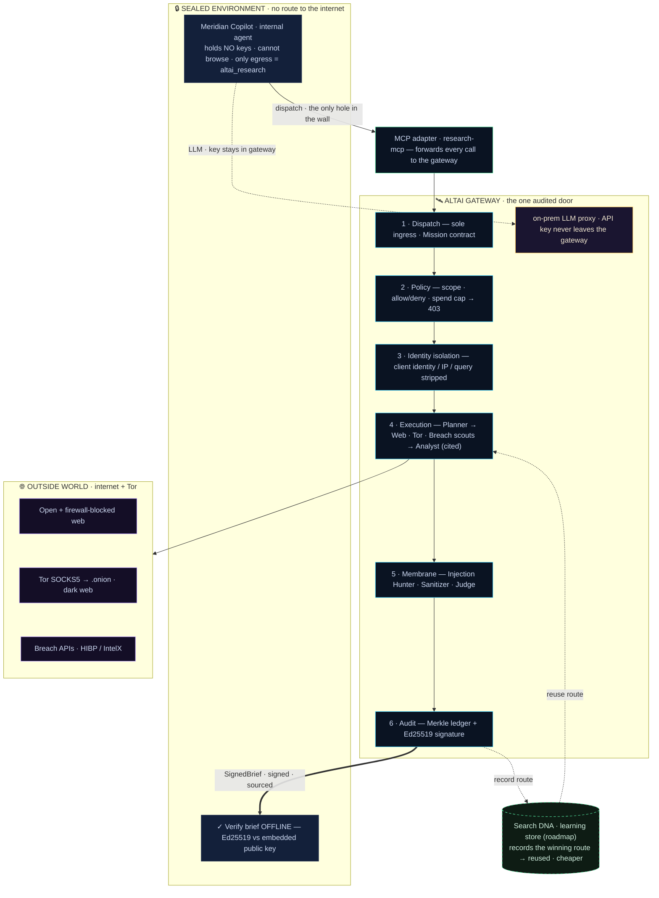
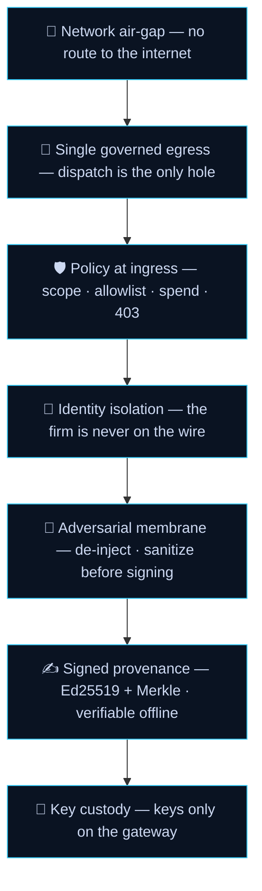

# Altai — global architecture

A sealed agent dispatches a mission through one audited door; an isolated fleet acts on the
outside; a cryptographically signed brief crosses back into the air-gap. The firm never
touches the wire.

## Security model — defense in depth (not a proxy)

